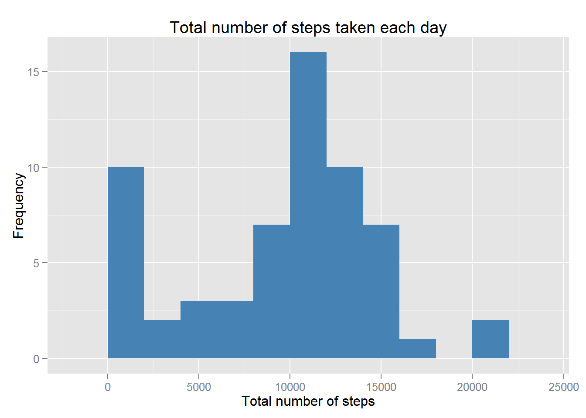
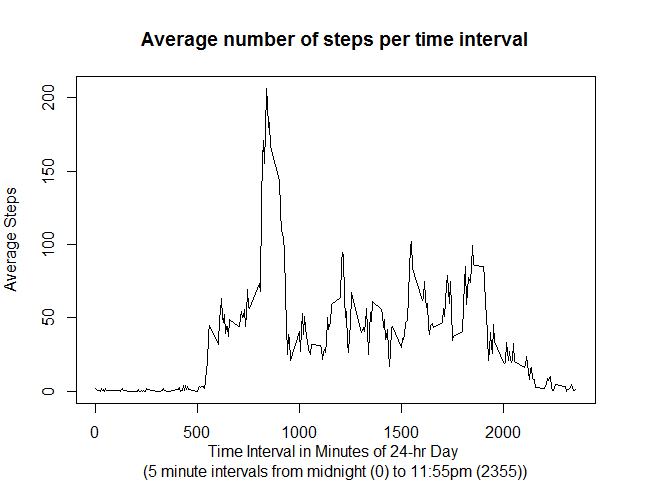
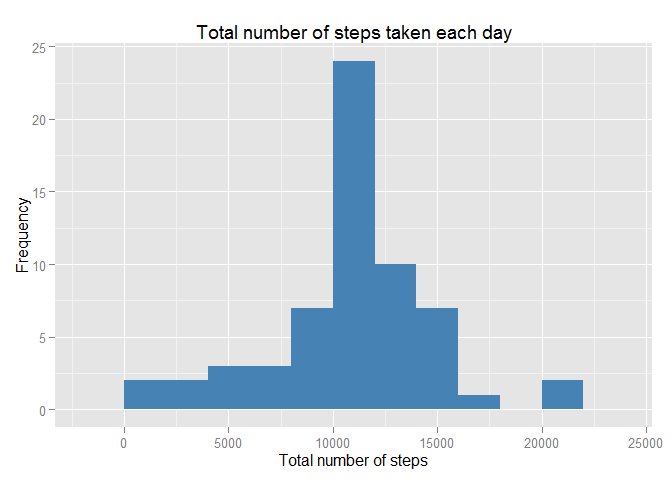
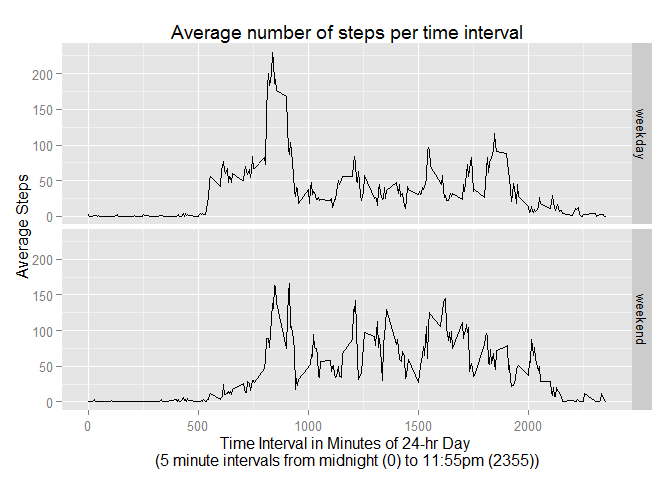

# Peer Assessment 1 - Template
Melanie Maggard  
Tuesday, August 18, 2015  

## Data Description
The data for this assignment was downloaded from the course web site and includes the following variables in 17,568 observations:

- steps: Number of steps taking in a 5-minute interval (missing values are coded as NA)

- date: The date on which the measurement was taken in YYYY-MM-DD format

- interval: Identifier for the 5-minute interval in which measurement was taken

##Loading and preprocessing the data


```r
setwd("~/RepData_PeerAssessment1")
data <- read.csv(file = "./activity.csv", head=TRUE, sep = ",")
data$date <- as.Date(data$date, format="%Y-%m-%d")
```

##Data analysis

###What is the mean total number of steps taken per day?

The total number of steps taken per day is:

```r
total_steps <- with(data, tapply(steps, date, sum, na.rm=TRUE))
total_steps
```

```
## 2012-10-01 2012-10-02 2012-10-03 2012-10-04 2012-10-05 2012-10-06 
##          0        126      11352      12116      13294      15420 
## 2012-10-07 2012-10-08 2012-10-09 2012-10-10 2012-10-11 2012-10-12 
##      11015          0      12811       9900      10304      17382 
## 2012-10-13 2012-10-14 2012-10-15 2012-10-16 2012-10-17 2012-10-18 
##      12426      15098      10139      15084      13452      10056 
## 2012-10-19 2012-10-20 2012-10-21 2012-10-22 2012-10-23 2012-10-24 
##      11829      10395       8821      13460       8918       8355 
## 2012-10-25 2012-10-26 2012-10-27 2012-10-28 2012-10-29 2012-10-30 
##       2492       6778      10119      11458       5018       9819 
## 2012-10-31 2012-11-01 2012-11-02 2012-11-03 2012-11-04 2012-11-05 
##      15414          0      10600      10571          0      10439 
## 2012-11-06 2012-11-07 2012-11-08 2012-11-09 2012-11-10 2012-11-11 
##       8334      12883       3219          0          0      12608 
## 2012-11-12 2012-11-13 2012-11-14 2012-11-15 2012-11-16 2012-11-17 
##      10765       7336          0         41       5441      14339 
## 2012-11-18 2012-11-19 2012-11-20 2012-11-21 2012-11-22 2012-11-23 
##      15110       8841       4472      12787      20427      21194 
## 2012-11-24 2012-11-25 2012-11-26 2012-11-27 2012-11-28 2012-11-29 
##      14478      11834      11162      13646      10183       7047 
## 2012-11-30 
##          0
```

The following is a histogram of the total number of steps taken each day:

```r
library(ggplot2)
qplot(total_steps,
    geom="histogram", 
    binwidth = 2000,
    main = "Total number of steps taken each day", 
    xlab="Total number of steps", 
    ylab="Frequency", 
    fill=I("steelblue")
    )
```

 

The mean and median of the total number of steps taken per day is:

```r
mean(total_steps, na.rm=TRUE)
```

```
## [1] 9354.23
```

```r
median(total_steps, na.rm=TRUE)
```

```
## [1] 10395
```

###What is the average daily activity pattern?

The following is a time series plot of the 5-minute interval (x-axis) and the average number of steps taken, averaged across all days (y-axis):

```r
average_interval <- data.frame(unique(data$interval), with(data, tapply(steps, interval, mean, na.rm=TRUE)))
names(average_interval) <- c("interval", "average_steps")

par(mar=c(4,4,4,4))
plot(average_interval$interval, average_interval$average_steps, type="l",
      main = "Average number of steps per time interval",
      xlab = "Time Interval in Minutes of 24-hr Day \n(5 minute intervals from midnight (0) to 11:55pm (2355))",
      ylab = "Average Steps"
     )
```

 

The 5-minute interval, on average across all days in the dataset, that contains the maximum number of steps is:

```r
max_interval<- average_interval$interval[average_interval$average_steps==max(average_interval$average_steps)]
max_interval
```

```
## [1] 835
```

This value corresponds to a time of 08:35am.

###Imputing missing values

The total number of missing values in the dataset is:

```r
missing <- sum(is.na(data))
missing
```

```
## [1] 2304
```

All missing values were replaced with the mean for that 5-minute interval, creating a new dataset.

```r
new_data <- merge(data, average_interval, by = "interval", all.x=TRUE)
new_data$steps[is.na(new_data$steps)] <- new_data$average_steps[is.na(new_data$steps)]
```

The following is a histogram of the total number of steps taken each day, when replacing the missing values with the mean for the 5-minute intervals:

```r
total_steps_new <- with(new_data, tapply(steps, date, sum))
qplot(total_steps_new,
    geom="histogram", 
    binwidth = 2000,
    main = "Total number of steps taken each day", 
    xlab="Total number of steps", 
    ylab="Frequency", 
    fill=I("steelblue")
    )
```

 

The mean and median of the total number of steps taken per day, when replacing the missing values with the mean for the 5-minute intervals, is:

```r
mean(total_steps_new, na.rm=TRUE)
```

```
## [1] 10766.19
```

```r
median(total_steps_new, na.rm=TRUE)
```

```
## [1] 10766.19
```

Do these values differ from the estimates from the first part of the assignment?  What is the impact of imputing missing data on the estimates of the total daily number of steps?

These values did differ significantly, which demonstrated that there was an impact of imputing missing data on the estimates of the total daily number of steps.  The mean when the NAs were excluded was 9354.2295082, which was 1411.959171 lower than the mean when the NAs were replaced with the mean for that time interval (mean = 1.0766189\times 10^{4}.  The median when the NAs were excluded was 10395, which was also lower than the median when the NAs were replaced with the mean for that time interval, which was 1.0766189\times 10^{4}.

###Are there differences in activity patterns between weekdays and weekends?

In order to answer this question we must create a new factor variable in the dataset with two levels - "weekday" and "weekend", indicating whether a given date is a weekday or weekend day.  We will use our new data with the missing values replaced with the values for the mean for the 5-minute intervals.


```r
library(lubridate)

new_data$day <- ifelse (grepl('^S', weekdays(new_data$date)), "weekend", "weekday")
new_data$day <- as.factor(new_data$day)
```

The following is a time series plot of the 5-minute interval (x-axis) and the average number of steps taken, averaged across all weekday days or weekend days (y-axis):


```r
new_average_interval <- aggregate(new_data$steps ~ new_data$interval + new_data$day, new_data, mean)
names(new_average_interval) <- c("interval", "day", "average_steps")

qplot(interval, average_steps, data=new_average_interval, geom="line" ,
    main = "Average number of steps per time interval",
    xlab = "Time Interval in Minutes of 24-hr Day \n(5 minute intervals from midnight (0) to 11:55pm (2355))",
      ylab = "Average Steps") +
    facet_grid(day ~ .) 
```

 
